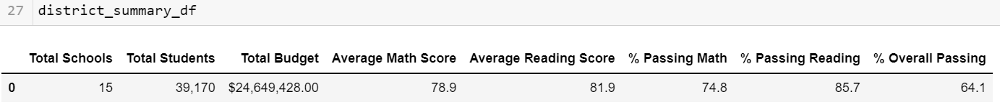

# Module 4 Challenge: School District Analysis
Module 4 work: Anaconda, Python and Jupyter Notebook
## An Overview
The challenge for this project is to analyze results of students taking standardized tests on Reading and Math proficiencies, provided by the school district. There were 15 schools with 39,170 students scores. We helped Maria, the chief data analyst for the school district, with the analysis so that she could provide insights to the student performance trends and pattern based on various factors at the school and district levels. We collected all the data and showcased the trend on school performance so that it could be presented to the school board and the superintendent to make informed decisions based on school budgets and priorities. We used Jupyter notebook in Pandas library and Python to analyze the data. 

## The Purpose
The purpose of this project is to learn the use of Jupyter notebook which is a package in Anaconda, a free open-source distribution. We created a virtual environment for Python 3.7 and used Pandas library. Pandas allowed us to work with Series and DataFrame. Pandas library allowed us to extract data from various sources, clean it and then transform and manipulate data while keeping the original dataset undisturbed. 

## Analysis of Data
The raw data from the school district had issues in two major categories. The work is done in the Python file: *PyCitySchools_Challenge.ipynb* using Jupyter notebook.
1. There were random "Dr.", "Mr.", "Mrs.", "Miss" as prefix and "MD.", "DVM, "PhD" as suffix. We cleaned out these from the using *str.replace* and replaced these suffixes and prefixes with blank space " ". The family suffixes, such as Jr., II, III, etc. were left unaffected.

2. The 9th grade students in Thomas High School cheated on the exam, which compromised the overall school performance data. We replaced the ninth grade students' math and reading scores with NaN to emilinate these scores from the calculation of the average and percentage of math and reading scores of Thomas High School. By eliminating the math and reading scores only and keeping the student names in the list we kept the school budget and spending data in tact. We used "loc" to locate the 9th grade students from Thomas High School, and then assigned NaN to the math and reading score. (See **Fig. 1** below. )

**Fig.1** - Thomas High School 9th grade math and reading scores are replaced with "NaN', keeping the grade of 10th, 11th and 12th grade students unaffected. The name of the students and their ID are blacked out to keep the student information private following *FERPA*  rules. 

## Results and Deliverables

### Deliverable 1

We replaced the 9th grade math and reading scores with _NaN_ keeping the score of the rest of the school data intact (See *Fig.1*). We were given 39,170 student data. The number of students stayed at 39,170 with 461 Thomas High School 9th grade student math and reading scorel replaced. 

- We used the following code to replace the 9th grade reading score from Thomas High School (THS) only: 

*student_data_df.loc[(student_data_df["school_name"] == "Thomas High School") & (student_data_df["grade"] == "9th"), "reading_score" ] = np.nan*

- We replaced the "reading score" in the above line with "math score" to replace the math score with NaN. 
- The result is shown in Fig. 1. 

### Deliverable 2

- **District Summery :** We calculated the District Summary before we made any changes in the 9th grade score (Fig. 2). There is a small difference in the overall percentage calculation. I am assuming that is because we are averaging over all the students (including the 461 THS 9th graders).  **Fig. 3** shows the District Summary of after the data manipulation of THS 9th grade score. The difference between the two data is less than 1%. 

**Fig. 2** - The District Summary DataFrame with all the data before removing 9th grade THS score. This screenshot is taken from *"PyCitySchools.ipynb"* Module 4 work, which uses the same data file.

**Fig. 3** - The District Summary DataFrame with all the data from *"PyCitySchools_Challenge.ipynb"*. This DataFrame is after removing 9th grade THS score.

- **School Summary, High Performing and Lowe Performing Schools :**  We created per school DataFrame before removing the 9th grade THS from the school average and performance data (See Fig. 4). With the 9th grade score the school has a low overall passing students (65.08%). We calculated the average math, reading and overall passing score after removing the 9th grade data. The overall passing  students of THS turns out to be in par with top performing schools (Fig. 6). The bottom performing schools are shown in Fig. 7.

**Fig. 4** - School summary with 9th grade score from THS. 

**Fig. 5** - School summary without the 9th grade score from THS.

**Fig. 6** - Top performing schools after 9th grade THS student score is dropped. 

**Fig. 7** - Bottom performing schools after 9th grade THS student score is dropped. 

## Different Matrics
The following figures showcases the data presented by different matrics.

  

**Fig. 8**  - Scores by grade level. The 9th grade score of THS does not affect 10th, 11th and 12th grade scores. This is true for both reading and math score.

  

 **Fig. 9** - This figure shows the summary of per student spending. There does not seem to be any correlation between student learning outcome and the amount of money spent on students. 

 **Fig. 10** - Ths figure shows the summary of student learning outcome based on the size of the school. A large school has lower number of students passing. 

 

 **Fig. 11** - This chart shows that the Charter schools perform better than the District schools. This matches with the fact that the Charter schools are usually smaller in size than the District school. 

 ## Summary

 We were given 39,170 student reading and math test scores from 15 schools. We had to remove the scores from the 9th graders in Thomas High School because of the report of academic misconduct. The removal of these 461 student scores changed the result of Thomas High School performance. However it did not change the overall outcome of all the students from 15 high schools. The math and reading average per school by grade levels did not change. Only the 9th grade scores from Thomas High School could not be counted. The budget and spending per students did not matter with this change since it was based on the number of students, and not based on the student performance. The data shows that the spending per student did not show any trend, but size of the school makes a difference in student performance. 
